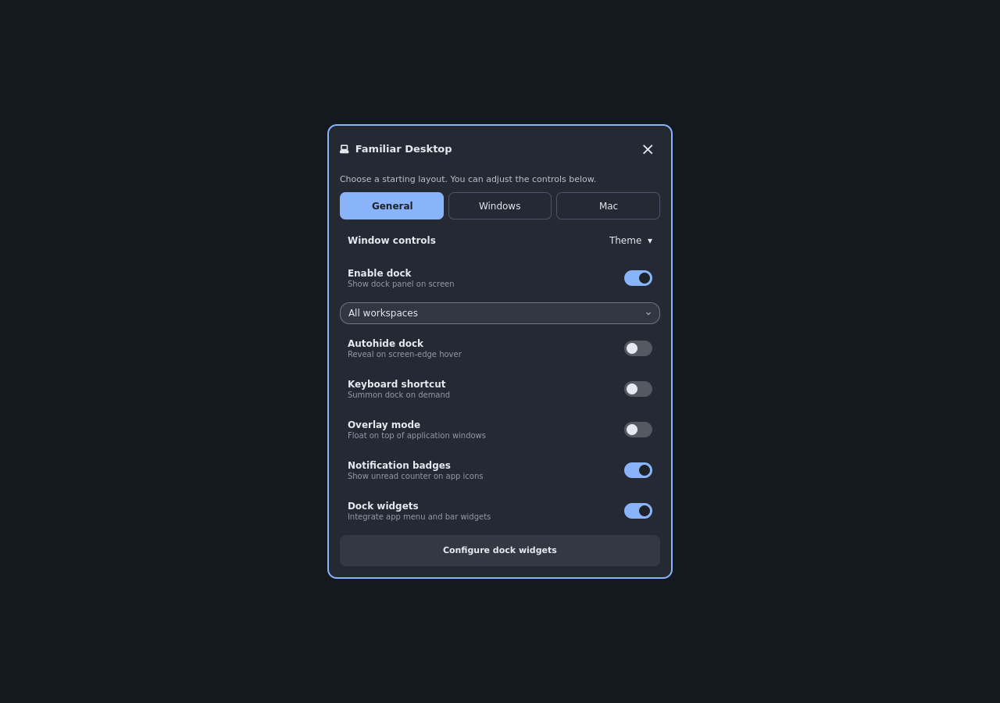

<h1 align="center">Familiar Desktop</h1>

<p align="center">
  <a href="https://github.com/tcballard/omarchy-badges"></a>
</p>

<p align="center"><strong>Find your apps and the right window without learning a new desktop first.</strong></p>

Familiar Desktop adds a mouse-friendly app dock to Omarchy Quattro. Launch or return to an app with a click; right-click to see its open windows by name and choose exactly where to go. General, Windows and Mac starting layouts share your pinned apps, so you can choose what feels comfortable and adjust it later.



*Rendered QML preview of the settings modal, using illustrative colours. A live Omarchy screenshot will replace this preview after on-device testing.*

## Install

On Omarchy Quattro, run:

```bash
omarchy plugin add https://github.com/tcballard/omarchy-plugin-familiar-desktop --enable
```

Familiar opens its setup screen automatically. Choose Windows or Mac controls and click **Set up Familiar**. It downloads and verifies the backend and window controls, then activates your desktop. Progress, errors and retry stay inside Familiar; no second terminal command is needed. Downloads start only after you click setup.

You can close setup and reopen it from Familiar's computer icon in the bar. Existing complete installations skip the setup screen. **Windows → Set up or repair window controls** opens the same flow later. Personal settings and pinned apps are retained; choosing a starting layout applies that layout's dock defaults.

The maintainer tested v0.1.1-rc.4 on the XPS and accepted its in-plugin setup for v0.1.2. The stable release changes version and release metadata, with no runtime behaviour changes after that acceptance.

Setup requires the standard Omarchy tools (including curl, jq and coreutils), Linux x86_64 and the supported Hyprland ABI below. Missing tools or unsupported desktops are reported inside setup; it never opens a terminal or silently installs system packages. Both downloaded binaries must match `release-binaries.sha256` in the installed source. See [source identity and limits](docs/INSTALLER-SOURCE-PIN.md).

### Standalone release installer

The [v0.1.2 release](https://github.com/tcballard/omarchy-plugin-familiar-desktop/releases/tag/v0.1.2) also includes a standalone installer and checksums for recovery. Normal setup uses the native plugin command above.

The installer refuses local source changes, untracked files and unexpected ignored files. It checks compatibility, restores windows on v0.1.0 updates, unloads controls and disables Familiar before checkout, then verifies binaries before setup and enablement. A failed update stops for repair. Missing download tools may prompt for a package-manager password.

The maintainer accepted v0.1.1-rc.4 after XPS testing for [v0.1.2](https://github.com/tcballard/omarchy-plugin-familiar-desktop/releases/tag/v0.1.2). Broader monitor, scaling and app coverage remains open; marketplace re-review is pending. Settings navigation and scrolling will be improved in a later release ([#28](https://github.com/tcballard/omarchy-plugin-familiar-desktop/issues/28)). The curated app collection is planned for v0.2.0; installed apps continue to work with the dock.

Window controls also download as a checksum-verified prebuilt Hyprbars library. The initial supported target is Linux x86_64, Hyprland 0.56.2 commit `efb50993780079460b0cbed1363e2166a2de1d9f`, ABI `efb50993780079460b0cbed1363e2166a2de1d9f_aq_0.15_hu_0.14_hg_0.5_hc_0.1_hlg_0.6`. Unsupported ABIs stop before backend installation or title-bar configuration. The normal installer never runs Hyprpm, clones Hyprland, or installs a compiler. Missing assets, checksum failures and loader failures stop setup; they never trigger a source build. Existing Hyprbars ownership protections still apply.

For a fresh installation, the installer fetches the pinned release commit into a temporary local repository and verifies its identity before passing that checkout to `omarchy plugin add`. It then verifies the registered checkout and completes setup before enabling Familiar. You do not need to run registration separately.

The shared `bin/familiar-desktop` Rust binary handles window actions, title-bar setup, theme parsing, app/icon scans and badge writes. Downloads happen during explicit setup, either in Familiar or through the standalone terminal installer. Familiar never compiles code on your desktop. Its setup screen launches the bundled download scripts only after your explicit setup action.

The plugin adds a **Familiar Desktop** control to the bar. First-time setup places it immediately before Agents in the right-hand section. If Agents is absent from that section, Familiar goes at the start of the right-hand group. Later updates and repairs preserve your chosen position. To apply the same placement to an existing installation, run `omarchy bar move io.github.tcballard.familiar-desktop --before omarchy.agents`.

Open Familiar's control to choose a starting layout and adjust dock settings. If you already use another dock, disable it before enabling this one so the two do not occupy the same edge.

### Dock and window controls together

Optional title bars add a visible window title, close, minimise and maximise
buttons, dragging and double-click to maximise. Mac controls sit on the left;
Windows controls sit on the right. Minimise uses the dock's existing window
helper, so the window can be restored from the same dock. The title is supplied
by the app, rather than a separate desktop-entry app name.

The installer above sets up both the dock and window controls. The installer downloads a verified prebuilt Hyprbars library for the supported Hyprland version; Hyprpm is not required.

If Familiar is already installed, open **Windows → Set up or repair window controls**
in its settings to run setup inside Familiar. Then select **Mac**, **Windows**,
or **Theme**, and press **Refresh window controls**. Theme mode reads
the active theme's [window-control defaults](docs/TITLEBAR-THEMES.md), including
enablement, placement, font, sizes, colours and exclusions. The Familiar theme
provides Windows defaults; themes without an enabled declaration leave bars off.
Explicit Off/Mac/Windows choices take precedence. Existing explicit title-bar
preferences are preserved; otherwise Theme is the default. Layout presets preserve
Theme and Off choices. Enabling controls also enables the dock so
minimised windows have a way back; disabling the dock disables its controls.

Setup needs Omarchy's Lua Hyprland configuration and a compatible Hyprbars build
with Lua button support. It probes compatibility before adding a marked block
to `~/.config/hypr/looknfeel.lua`, preserves the rest of that file and refuses
to adopt a loaded Hyprbars installation belonging to another setup. After a
Hyprland update, rerun setup if controls report a compatibility failure.

Apps that already draw their own header may show two title bars. Enter their
exact Hyprland window classes in **Skip apps with their own title bars**, separated
by commas. Fullscreen, grouped windows and mixed display scales need an on-device
check; this feature has portable test coverage, not live desktop verification.

Switch **Window controls → Off** to disable them. Disabling/unloading Familiar
also requests cleanup; an abrupt shell crash can leave controls active until
the next shell start or explicit cleanup. Before removing Familiar, remove its
configuration hook:

```bash
~/.config/omarchy/plugins/io.github.tcballard.familiar-desktop/bin/familiar-desktop titlebars remove
```

This removes only Familiar's marked block and generated configuration; it leaves
Hyprbars installed. The generated configuration checks that Familiar's manifest
still exists, so removal prevents bars loading on the next Hyprland reload.

Launching apps uses Omarchy's app launcher, with `uwsm-app` and `gtk-launch` as fallbacks. Supported command-line apps use `foot`; copying the shortcut uses `wl-copy`. Audio controls use `wpctl`. These integrations use the corresponding tools already installed on Omarchy. The plugin reads local app entries, window information, theme settings and notification counts. It launches apps and Omarchy actions when requested; it has no account login or built-in network client.

## Made for everyday use

- **See what is running.** Pinned apps and running windows stay within reach, with indicators and notification badges from the dock implementation.
- **Choose a window by name.** Right-click an app for a scrollable window list, window recovery and arrangement, New Window, Pin or Unpin, and actions to minimise or close the selected window.
- **Use the mouse or keyboard.** Left-click launches or switches, middle-click opens a new window, and the existing dock supports keyboard selection and window cycling.
- **Keep your setup.** Pins and folders are shared between layouts; changing a preset does not install applications, themes or global shortcuts.

### Choose a layout

| Starting layout | Placement | Visibility | Window space |
| --- | --- | --- | --- |
| **General** | Opposite the Omarchy bar | Always visible | Reserves space |
| **Windows** | Bottom when the bar is elsewhere | Always visible | Reserves space |
| **Mac** | Bottom when the bar is elsewhere | Reveals on hover | Overlays windows |

In **Settings → Dock → Dock position**, choose **Automatic**, **Bottom**, **Left** or **Right**. Automatic keeps the starting-layout placement above. Left and Right arrange icons vertically, with menus opening into the screen. Your explicit position survives layout changes and shell restarts. If Omarchy’s bar occupies your chosen edge, Familiar temporarily uses the opposite edge and explains this in settings; your preference takes effect again when that edge is free.

The layout names describe starting behavior; this build does not reproduce a complete Windows taskbar or macOS Dock. After selecting a preset, you can change visibility, workspace targeting, badges and widgets individually. Those adjustments remain until you choose another preset.

## Controls

| Action | How |
| --- | --- |
| Launch or switch to an app | Left-click its icon |
| Visit an open window | Right-click its icon, select a window, then choose **Go to / restore** |
| Recover or arrange a window | Select it in the app menu, then choose **Bring here** or **Arrange selected window** |
| Show Home, Downloads and Bin | Enable file shortcuts in Familiar settings |
| Open another window | Middle-click its icon or choose **New Window** |
| Pin, unpin, minimize or close | Right-click its icon and choose the action |
| Change layout and settings | Click the computer icon in the bar to open centred settings |

For scripting, the preset switch is also available through Omarchy shell IPC:

```bash
omarchy-shell io.github.tcballard.familiar-desktop setProfile general
omarchy-shell io.github.tcballard.familiar-desktop setProfile windows
omarchy-shell io.github.tcballard.familiar-desktop setProfile mac
```

## Clean removal

Settings and generated Lua stay in Familiar-owned files. Optional title bars and
Caps Lock use small guarded includes in your Hyprland configuration. For verified
cleanup before deleting Familiar, run:

```bash
bash ~/.config/omarchy/plugins/io.github.tcballard.familiar-desktop/uninstall.sh
```

The script restores journalled windows, stops if minimised windows remain, disables
Familiar, resets Caps Lock, removes the owned title-bar include and unloads Hyprbars
before removal. Edited hooks or failed reloads stop deletion. Preferences and
backups remain. It calls the standard `omarchy plugin remove io.github.tcballard.familiar-desktop`
after cleanup succeeds; running that command directly does not run this cleanup.
See [separate configuration and rollback](docs/ROLLBACK.md) for exact guarantees,
legacy migration and XPS acceptance.

## Updates and retained preferences

Use Omarchy's plugin update flow to update the checkout, then open Familiar's in-app setup to install or repair the matching binaries. The standalone installer from the selected release remains available for recovery. For removal, use the installed `uninstall.sh` shown above; the generic remove command alone does not perform the owned-configuration cleanup.

The plugin writes `~/.config/omarchy/familiar-desktop-settings.json`, `~/.config/omarchy/familiar-desktop-pinned.json` and `~/.local/state/omarchy/familiar-desktop-badges.json`. Removing it leaves these preferences and badge data in place. Dock widgets appear alongside existing bar widgets. Dock settings only change Familiar Desktop; `shell.json` is read for bar placement and is never written by this plugin. Switching dock widgets off preserves your selection for when you turn them back on. It does not install the [Familiar theme](https://github.com/tcballard/omarchy-theme-familiar), Task Manager or OmaStore.

If you moved bar widgets into the dock using an earlier development build, add them back through Omarchy's bar settings. This build preserves old placement metadata in its settings file but does not automatically rewrite your bar layout.

## Development and status

The manifest declares a hosted service and bar widget under `io.github.tcballard.familiar-desktop`. The source derives from [rosakodu/omarchy-dock](https://github.com/rosakodu/omarchy-dock) at commit `467070386fe60e173295020d3911176202b3e0c9` (MIT). This project has separate identity and settings while retaining that dock's window, monitor, folder and theme handling. See [the product record](PRODUCT.md) for the current scope and next milestones.

Portable plugin validation and the tests in `tests/run` pass. The maintainer accepted v0.1.1-rc.4 after XPS testing on 6 October 2026. The preview is an isolated QML render. We do not claim exhaustive coverage of multi-monitor hotplug, mixed scaling, every application or fresh-profile install/removal. Marketplace verification remains separate from the release. Report bugs or suggest improvements through the [GitHub issue forms](https://github.com/tcballard/omarchy-plugin-familiar-desktop/issues/new/choose); report sensitive security issues privately through the repository's GitHub security advisory feature.

On Omarchy, validate and test the checkout with:

```bash
omarchy plugin validate .
```

See [validation notes](docs/VALIDATION.md) for automated coverage, the preview source and the remaining desktop checks.

MIT licensed. Original work © 2026 rosakodu; Familiar Desktop changes © 2026 Tom Ballard. See [LICENSE](LICENSE).

### Window actions and file shortcuts

Familiar includes an expanded dock window menu. Select a named window
and use **Go to / restore** to visit it, or **Bring here** to move it to the
currently focused workspace. Workspace and minimised labels help locate windows.
**Arrange selected window** offers left/right half, centre, maximise, floating,
return to tiling, and next monitor. Half-screen and centre actions make only the
selected window floating; returning to tiling uses the current Hyprland layout.
These actions are available through the dock menu, not the title-bar buttons.

Enable **Home, Downloads and Bin shortcuts** in Familiar settings to add three
file-manager launchers to the dock. They default to off. Downloads follows
`xdg-user-dir DOWNLOAD`; opening uses `gio open` and the installed file manager.
The Bin button opens the bin; it never empties it. Command failures appear in the
window menu or the file shortcuts' hover tooltip. The version-pinned installer supplies the matching backend.

### Development builds

For ad-hoc branch builds, installation and rollback without RC tags, see
[the development workflow](docs/DEVELOPMENT.md). Desktop acceptance of the exact
commit is required before merging feature work into `main`.

Only contributors building from source need Rust 1.88+ and Cargo. Run `bash build.sh` explicitly. Clippy and Qt tests run in CI; the normal installer never requests them. Release CI builds Hyprbars against a dated Arch package snapshot and verifies its header ABI, alongside a static Linux x86_64 backend. It tests it without a toolchain on PATH, and publishes it with checksums and source manifests.

### Caps Lock behaviour

In Familiar settings choose **Normal Caps Lock**, **Compose key**, or **Use
configuration**. Opening settings or switching a layout does not change your
keyboard. Normal Caps Lock toggles capitals; Compose uses Caps Lock for
special-character sequences. AltGr/Right Alt, Compose on other keys and unrelated
keyboard options remain intact. Caps-based layout switches and the both-Shift
Caps Lock shortcut are replaced. Per-device overrides still take precedence.

The explicit preference is stored in `~/.config/omarchy/familiar-input/caps-lock.lua`.
A small guarded include is added at the end of
`~/.config/hypr/hyprland.lua` (or `$XDG_CONFIG_HOME/hypr/hyprland.lua`). The separate Lua file reads the
configured keyboard options on each reload and login; `input.lua` and Omarchy
core files are never edited. Familiar checks the reload and restores the previous
configuration if applying the preference fails. Backups are kept under
`${XDG_STATE_HOME:-~/.local/state}/omarchy/familiar-caps-lock/`.

**Use configuration** removes that include and generated keyboard file, then reloads your current personal
configuration. The preference persists when the Familiar UI is disabled; reset it
before downgrading or removing Familiar. If the plugin is removed without reset,
the block becomes inactive when Hyprland next reloads because the plugin manifest
is absent. Edited/damaged blocks and symlinked main configs are refused rather than
overwritten. See [the Caps Lock guide](docs/CAPS-LOCK.md) for recovery and testing.

## v0.1.2

Setup now stays inside Familiar. See [release notes](docs/v0.1.2.md) and [release evidence](docs/RELEASE-0.1.2.md). The repository `install.sh` is a CI template; standalone recovery uses the generated release asset.

### Input preferences

Settings → Input offers **Command / Option / Control** or **Super / Alt / Ctrl**
labels. This changes Familiar’s shortcut display and search, not keybindings;
copyable Lua still uses Hyprland’s canonical modifier names.

Trackpad gestures are opt-in, with workspace-only, desktop-only and combined
choices: three-finger horizontal swipes switch workspaces; four fingers down
shows the desktop and four fingers up restores windows. Hyprland-reported
conflicts roll back the choice rather than deleting an existing gesture. Choose
Desktop only if your workspace swipes are already configured. Use configuration
removes Familiar’s owned gesture file and include. Existing touchpad tap and
natural-scroll preferences are retained. Two-finger right-click taps require
that setting in your system configuration. Smooth scrolling over an app with
multiple windows cycles those windows, with accumulated motion to avoid jumping
on every small trackpad event.

These preferences were introduced in v0.1.1. Exhaustive device-specific gesture, sensitivity and conflict coverage is not claimed.

### Mouse resizing, desktop modes and Command behaviour

Windows → **Enable border dragging** lets you resize at window edges/corners
without holding a key. **Floating** and **Tiling** now switch already open eligible
windows across regular workspaces as well as setting the policy for new windows.
Fullscreen, pinned, grouped and hidden windows are skipped. Hyprland retains
control of its tiling layout and keyboard shortcuts; individual failed actions
are reported and can be retried by selecting the mode again.

Input → **Command editing shortcuts** is separate from shortcut labels. It
explicitly replaces Super+C/V/X/A/Z and Super+Shift+Z until reset. GUI apps receive
Ctrl editing shortcuts; known terminals receive Ctrl+Shift+C/V for copy/paste
and pass through the other aliases. Supported terminal identities include Kitty,
Alacritty, Foot, WezTerm, Ghostty, GNOME Terminal, Konsole, XTerm, URxvt, st,
Terminator and Tilix. Custom terminal classes require review before enabling.
This is scoped editing support, not a global modifier swap or full macOS emulation.

Both preferences are opt-in, reversible from **Use configuration**, and removed
by uninstall. Existing title bars remain optional within the integrated plugin.
